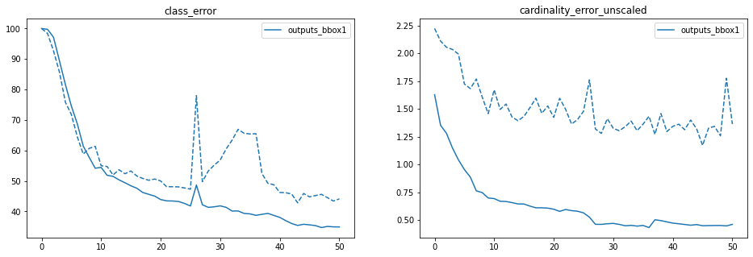

# Predicting Panoptic Segmentation for Enginering Materials Dataset

Panoptic segmentation is an image segmentation method used for Computer Vision tasks. It unifies two distinct concepts 
used to segment images namely, semantic segmentation and instance segmentation.In this project I have used Deep Learning 
Techinques to predict panoptic segmentation for Engineering materials

# I. Problem Statement

In this project DETR model to first perform training for object detection and then done training for panoptic segmentation
 for Engineering materials 

The dataset is available in link below.

https://drive.google.com/file/d/1IsK268zLnXB2Qq0X2LgNDwBZRuVwvjRx/view?usp=sharing

Images in the dataset are annotated with cvat tool

Major Highlights:

-  Used Panoptic DETR is used to generated ground truth of stuff for images givens
-  Final dataset is combined with coco stuff dataset
-  Fine tuning is done on the final dataset to first train the bounding boxes
-  The weights from training bounding boxes are frozen and then panoptic segmenation is done 

## Running the code

You can use download the code

git clone https://github.com/monimoyd/panoptic_image_segmentation_with_detr.git 

Jupyter Notebook link:

There are three notebooks ( Because of large size, two notebooks giving the colab link):

https://colab.research.google.com/drive/1pcyq_DZYr5OxonJseosyWq4p702hq3Yq?usp=sharing : Used for training bounding boxes
https://github.com/monimoyd/panoptic_image_segmentation_with_detr/blob/main/detr_train_engineering_materials_summarized_panoptic2.ipynb : used for training panoptic segmentation
https://colab.research.google.com/drive/1n0bIBnjlfRCK50BnTMKMfNsAgbbhrnaZ?usp=sharing : Used for prediction of panoptic segmentation
 
## II. DETR

In this project I have used DETR a deep learning based transformer model to predict bounding boxes for Engineering Materials
Dataset. DETR which stands for DEtection TRansformer is developed by Facebook AI and probably the most effective Computer Vision
 Algorithm which is empowered with Object classification, Object Detection, Semantic Segmentation and many other Deep learning 
 tasks. It extends the Transformer based architecture by infusing more intelligence w.r.t adding many object queries to the
 Decoder Architecture.
 
 More details about DETR can be found in URL below:
 
 https://github.com/nkanungo/EVA6_DETR#readme

## IIi. Data Cleaning and Data Loading

The engineering material dataset has 48 categories of various engineering materials like cu_piping , adhesives etc.

### Structure of the dataset

.
├── class_name_1   
│   ├── class_details.txt   
│   ├── coco.json   
│   └── images   
│       ├── img_000.png   
│       ├── img_001.png   
├── class_name_2   
│   ├── class_details.txt   
│   ├── coco.json   
│   └── images   
│       ├── img_000.png   
│       ├── img_001.png   
.

Each image has annnotation for just the annotation for the given category. As there was no
stuff annotations present.

To add the stuff annotation, each of the image is predicted with DETR panoptic segmentation code having
resnet101 backbone which was pretrained with Coco dataset. The bounding boxes predicted by  DETR panoptic segmentation
 only those bounding boxes are considered for which confidence is more than 0.85.

The jupter notebook generate_ground_truth.ipynb is used to convert 

The bounding box predicted by DETR panoptic segmentation are normalized format (0-1) and it has Xcenter, Ycenter, width and height
but the coco dataset bounding box is stored in (Xleft, Yleft, width, height) which are actual pixel position. To convert
the bounding boxes predicted by DETR panoptic segmentation to COCO format the folowing formula is used:

Xleft = Image Width * ( Predicted Xcenter - 0.5 *  Predicted width)
Yleft = Image Height * ( Xcenter - 0.5 * Predicted height)

The binary mask predicted by DETR panoptic segmentation is converted to RLE format for each object in image using 
pycocotools mask.encode API.

Categories used for engineering dataset are as below:

0 - Misc Stuff (these are all the Coco thing object predicted by DETR panoptic segmentation code  
1-48 - Classes used for engineering materials  
49 - 63 - Coco stuff labels are hirerachially organized where some of categories are grouped together
          under super category. I have all the supercategories as classses these are :   
	49. building  
        50. ceiling  
        51. floor  
        52. food  
        53. furniture  
        54. ground  
        55. plant  
        56. rawmaterial  
        57. sky  
        58. solid  
        59. structural  
        60. textile  
        61. wall  
        62. water  
        63. window  

For each annotation json provided for each category an intermediate csv file with fields as below:

id - A unique annotation id  
image_id - A unique image id  
image_path - path where image is lying  
width - width of image  
height - height of image  
bbox - Bounding box  
segment_map - Segmentation map converted to RLE format  
source - Source from where record is generated. 1 for annotation file, 2 for predicted from DETR panoptic segmentation code, 3 for coco stuff dataset  
area - Area of bounding box  
segment_polygon - Polygon coordinates for segments  

As the engineering materials dataset does not  have all the stuff, so the coco validation stuff dataset is added for training and for this also an intermediate
csv file is created

While generating csv files, Any of the image which is grey images or images in WEBP format are ignored.

All the intermediate csv files are combined using into two jsons, custom-val.json and custom-train.json
using Jupyter notebook. While combining all the csv files , each image is given a unique id with format category name concated with image id.

## IV. Ground Truth Generation Workflow
Workflow is explained using the diagram below:

 

Here all class jsons and the stuff prediction using panoptic segmentation are combined to a corresponding class csv file.
In addition stuff annotation for coco validation dataset is also converted to coco_stuff.csv. All the csvs are combined into 
two annotation json files custom-train.json and custom-val.json. From the processing valid images from engineering materials
dataset 90% are randomly assigned to training and 10% to validation. However all the images from Coco validation dataset are
assigned to training only.

There are a few filtering steps done:  

i. If the predicted annotations after running panoptic code has 90% or more overlapping with any of  main class annotation
 or it is completely inside any of main class annotation, the annotation is dropped
 
ii. The annotations are checked for any deformity like if the sum of left x cordinate and width of annotation exceeds the image 
width or if the sum of left y cordinate and height of annotation exceeds teh image height the correspoding annotation is dropped

## V. Training

As the combined image size is very large, it is split into multiple zip files and then unzipped using the structure below
and training is done to predict bounding boxes

/content/data/custom  
├ annotations/  # JSON annotations  
│  ├ annotations/custom_train.json  
│  └ annotations/custom_val.json  
├ train2017/    # training images  
└ val2017/      # validation images

The DETR code used for training from repository https://github.com/woctezuma/detr.git and pretrained weights are loaded from 
URL https://dl.fbaipublicfiles.com/detr/detr-r50-e632da11.pth' 

As the classes number of object classes were imbalanced, to solve this the following techniques are used:

1. Number of objects per class is limited to 250 but multiple datasets are created so that all classes can be trained
2. Coco Stuff annnotations are added from Training dataset
3.  class weights are adjusted to give more weightage to minority classes and less weightage to majority classes. misc_stuff 
which has more than 10000 objects is given weightage of 0.1, any of the classes which has less than 100 objects is given
class weightage of 2 and all others are given weightage of 1.
  

Once bounding boxes training is done for 50 epcochs, weigths are frozen and panoptic segmentation is done.

Pantoptic segmentation can be visually explained using the image below:

The following directory structure is used for putting data during panoptic segmentation

/content/data/custom  
├ annotations/  # JSON annotations  
│  ├ annotations/panoptic_train2017.json  
│  └ annotations/panoptic_val2017.json  
├ train2017/    # training images  
└ val2017/      # validation images

For running panoptic segmenation the following changes were done in detr code repository

coco_panoptic.py :   
CocoPanoptic class __getitem__  is changed to load the images and annotations. As segment information from coco stuff dataset is 
in compressed RLR format, while ground turht RLEs created during panoptic prediction are integer RLE format, so both
were combined and converted to binary mask

detr.py:  
__init__ method in SetCriterion class is modified by changing weights in empty_weight variable to provide differential
class weights. 
build method is modified by changing num_classes to 64

engine.py:

This file is modified to use only panoptic_evaluator during evaluations

main.py:

This file is modified to change default weights

The call for panoptic segmentation is done using the command below:

! python main.py \
  --masks \
  --dataset_file "coco_panoptic" \
  --coco_path "/content/data/custom/" \
  --coco_panoptic_path "/content/data/custom/" \
  --output_dir "/content/drive/My Drive/eva6_capstone_final_summarized_result/outputs_panoptic" \
  --frozen_weights "/content/drive/My Drive/eva6_capstone_final_summarized_result/outputs_bbox1/checkpoint.pth" \
  --num_classes $num_classes \
  --epochs 50 \
  --lr 1e-5 \
  --lr_drop 1000 \
  --num_queries 30 \
  --batch_size 1

Hyperparameters:

Number of queries: 30
Learning Rate: 1e-5
Number of classes: 64
Batch Size: 1

## VI. Loss Functions used

### CE Loss:

This is the classification cross entropy loss between predicted class and actual class

### L1 Loss

This is the L1 regression loss between predicted and target bounding boxes

### GIOU Loss:
GIOU is a improved version of IoU loss
In IoU, where there is no intersection, IoU has no value and therefore no gradient. GIoU however, is always differentiable.
GIOU , which is formulated as follows:

GIoU=|A∩B||A∪B|−|C∖(A∪B)||C|=IoU−|C∖(A∪B)||C|
Where A and B are the prediction and ground truth bounding boxes. C is the smallest convex hull that encloses both A and B. 

### Dice Loss:
Dice loss is a measure of overlap between two samples. This measure ranges from 0 to 1 where a Dice coefficient of 1 denotes perfect and complete overlap. The Dice coefficient was originally developed for binary data, and can be calculated as:

Dice=2|A∩B| / (|A|+|B|)
where |A∩B| represents the common elements between sets A and B, and |A| represents the number of elements in set A (and likewise for set B).

### Focal Loss:
Focal Loss (FL) is an improved version of Cross-Entropy Loss (CE)  that tries to handle the class imbalance problem by assigning more weights to hard or easily misclassified examples  (i.e. background with noisy texture or partial object or the object of our interest ) and to down-weight easy examples (i.e. Background objects).

So Focal Loss reduces the loss contribution from easy examples and increases the importance of correcting misclassified examples.

## Bounding Box Loss:

Bounding Box Loss is a combination of L1 Loss and GIOU loss between predicted and target bounding boxes

## Mask Loss:

Mask Loss is a combination of Focal Loss and Dice Loss

## Total Loss:
Total Loss is combination of CE Loss, Bounding Box Loss and Mask Loss. During panoptic training, I used weights different than default os as to 
give more weighage to mask loss, CE loss and less weightabe to bounding box loss

mask_loss_coef : 4
bbox_loss_coef: 1
dice_loss_coef: 2
giou_loss_coef: 2
set_cost_class: 3

## VI. Results:

I took some model weights after 6th epoch and applied prediction on
validation Dataset as below

### i.

#### Ground truth with bounding boxes:

#### Predicted bounding boxes:

#### Attention Mask:

#### Panoptic Segmentation:

### ii.

#### Ground truth with bounding boxes:

#### Predicted bounding boxes:

#### Attention Mask:

#### Panoptic Segmentation:

### iii.

#### Ground truth with bounding boxes:

#### Predicted bounding boxes:

#### Attention Mask:

#### Panoptic Segmentation:

### iv.

#### Ground truth with bounding boxes:

#### Predicted bounding boxes:

#### Attention Mask:

#### Panoptic Segmentation:

### v.

#### Ground truth with bounding boxes:

#### Predicted bounding boxes:

#### Attention Mask:

#### Panoptic Segmentation:

## VII. Evalutation Metrics Used and Plots:

Various metrics are: 

### mAP : 
is Mean Average Precision. Its use is different in the field of Information Retrieval (Reference [1] [2] )and Multi-Class classification (Object Detection) settings. To calculate it for Object Detection, you calculate the average precision for each class in your data based on your model predictions. Average precision is related to the area under the precision-recall curve for a class. Then Taking the mean of these average individual-class-precision gives you the Mean Average Precision. 

## Cardinality Error:
It is teh absolute error in the number of predicted non-empty boxes.  This is not really a loss

## Class Error:

Class error is measured below:
100 - accuracy(source logits, target_classes)

### i. Loss and mAP Plots

### ii. Loss CE, Loss Bounding Box, Loss GIOU Plots

### iii. Class Error, Cardinality Error Unscaled plot Plot

##  VIII. Issues faced

### i. Json marshalling issue

While converting to json from CSV, faced Exception that says marshalling can not be performed because int64 is used. This is
because when I loaded dataframe from csv file and converted to basic type it was numpy.int64 format which JSON
could not marshal. I need to convert the type explicitly to int to fix the issue 

### ii. Changin number of queries

I used number of queries as 30 specified it as a paramer in main.py. While inferring when I loaded the model and loaded
the weights from checkpoint, I was getting Runtime Exception of dimension mismatch as the model query embedding has dimension
(30, 256) but it was expecting dimension (100, 256)

To solve this, I explicitly changed the query embedding dimension using the following lines:

model.num_queries=30
model.query_embed = torch.nn.modules.sparse.Embedding(30, 256)

Also before training, I used the additional line below:

del checkpoint["model"]["query_embed.weight"]

### iii. Junk characters in segmentation

While checking the segmentation field in coco stuff annotation, I initially thought these are junk characters. After study
and discussions, I realized these are mask encoded in RLE format

### iv. Deformed Bounding Box Error

There was a assertion error during training and it was because of deformed bounding boxes generated and some assert statement 
for bounding box check was failing. To fix this issue, I run a sanity check on all the annotations for the followinng
1. If summation of the left x value of bounding with annotation width exceeds image width, drop the annotation
2. If summation of the left y value of bounding with annotation height exceeds image height, drop the annotation
3. If there is any negative value in x,y, width or height drop the annotation

### iv. Corruption of RLE data

For the segmenation info, initially I was storing the RLE info as a compressed binary format. Because of intermediate csv step followed by 
final json step, the segmentation info was stored as binary string. But when I load for panoptic segmenation, it got corrupted and I spent
some time using methods like removing multiple backslash but I still could not recover. When the corruption happend, there was segmentation fault, core dumped and notebook crashed. So I need to regenerate the processed dataset again and this time I used running numbers as integers rather than binary and it worked

##  IX. Conclusion

In this project I have learned how to prepare engineering materials dataset, right from image collection to annotation
using CVT tool. Next, I cleaned and prepared dataset by applying DETR panoptic segmentation code to get ground truth for 
stuff. Next, I did fine tuning using DETR model. This project gave me exposure to end to end Object detection.

